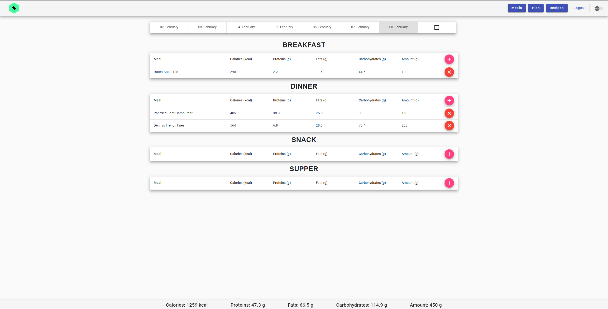
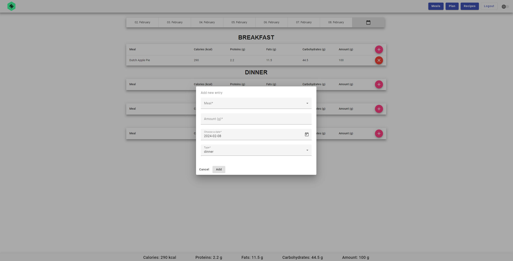
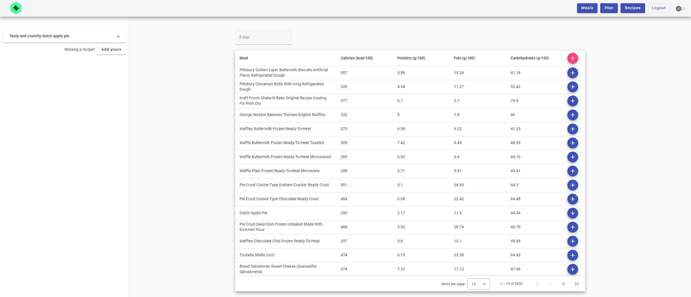

# DietPlannerApp

This is a web application created for my thesis and for learning Angular, TypeScript and other modern web technologies. The main functionality of the application is to allow the user to create and manage their diet plan.

This project was generated with [Angular CLI](https://github.com/angular/angular-cli) version 15.2.7.

## Backend application

The project containing the application backend is in a [different repository](https://github.com/roejk/dietplanner-backend).

## Features

* User registration and login
* Displaying a list of meals
* Adding new meals
* Displaying a plan with meal entries with summary of calorie and nutrients for any chosen day 
* Adding new entries
* Displaying a list of recipes
* Adding new recipes

## Screenshots

## Development server

Run `ng serve` for a dev server. Navigate to `http://localhost:4200/`. The application will automatically reload if you change any of the source files.

## Code scaffolding

Run `ng generate component component-name` to generate a new component. You can also use `ng generate directive|pipe|service|class|guard|interface|enum|module`.

## Build

Run `ng build` to build the project. The build artifacts will be stored in the `dist/` directory.

## Running unit tests

Run `ng test` to execute the unit tests via [Karma](https://karma-runner.github.io).

## Running end-to-end tests

Run `ng e2e` to execute the end-to-end tests via a platform of your choice. To use this command, you need to first add a package that implements end-to-end testing capabilities.

## Further help

To get more help on the Angular CLI use `ng help` or go check out the [Angular CLI Overview and Command Reference](https://angular.io/cli) page.
